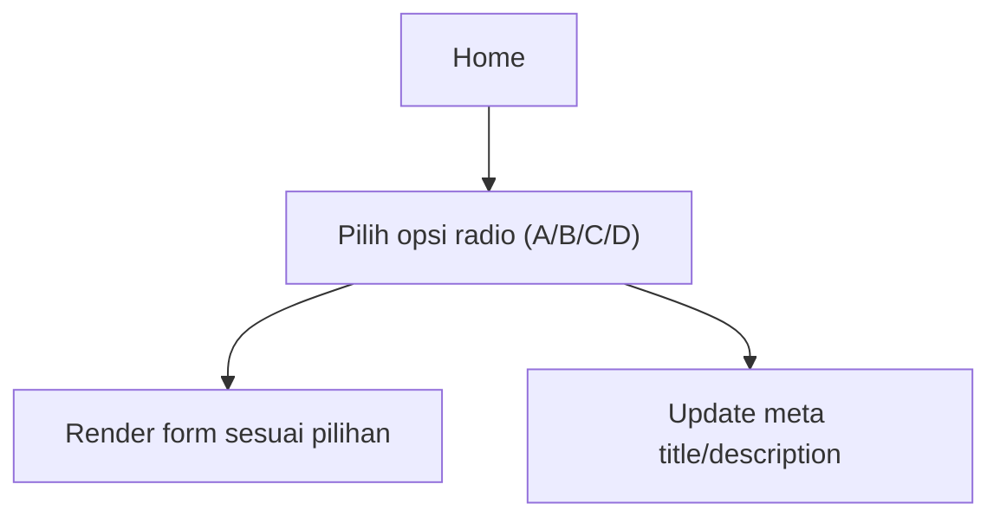

## 1. Product Overview
Menjadikan `app/page.tsx` sebagai Home yang berisi 4 pilihan form melalui radio menu.
Setiap form dipecah menjadi komponen terpisah, dan meta title/description halaman berubah mengikuti form yang dipilih.

## 2. Core Features

### 2.1 Feature Module
1. **Home**: radio menu 4 opsi, area konten form dinamis, meta title/description dinamis sesuai opsi, pemecahan komponen per form.

### 2.2 Page Details
| Page Name | Module Name | Feature description |
|-----------|-------------|---------------------|
| Home | Header meta dinamis | Mengatur title dan description default saat pertama kali buka; memperbarui title dan meta description saat user mengganti pilihan radio. |
| Home | Radio menu (4 opsi) | Menampilkan 4 opsi pilihan (single select) untuk menentukan form aktif; menandai state terpilih dengan jelas. |
| Home | Form container (switcher) | Merender tepat 1 form sesuai opsi radio; mengelola state `selectedForm` dan mapping opsi→komponen form. |
| Home | Komponen Form A | Menyediakan UI form untuk opsi A sebagai komponen terpisah (mis. `<FormA />`). |
| Home | Komponen Form B | Menyediakan UI form untuk opsi B sebagai komponen terpisah (mis. `<FormB />`). |
| Home | Komponen Form C | Menyediakan UI form untuk opsi C sebagai komponen terpisah (mis. `<FormC />`). |
| Home | Komponen Form D | Menyediakan UI form untuk opsi D sebagai komponen terpisah (mis. `<FormD />`). |

## 3. Core Process
Alur pengguna:
1) Kamu membuka Home dan melihat radio menu dengan 4 opsi.
2) Kamu memilih salah satu opsi radio.
3) Area form berganti ke form yang sesuai pilihanmu.
4) Title dan description halaman ikut berubah mengikuti pilihan form aktif.

