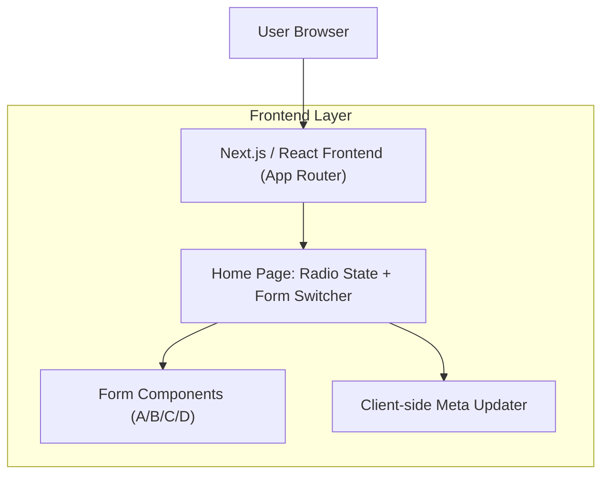

## 1.Architecture design

## 2.Technology Description
- Frontend: Next.js (App Router) + React + TypeScript
- Backend: None

## 3.Route definitions
| Route | Purpose |
|-------|---------|
| / | Home yang menampilkan radio menu 4 opsi, form aktif, dan meta dinamis mengikuti pilihan |

## 4.API definitions (If it includes backend services)
- Tidak ada backend/API baru (semua berjalan di frontend).

## 6.Data model(if applicable)
- Tidak ada kebutuhan data model/database untuk perubahan ini.
